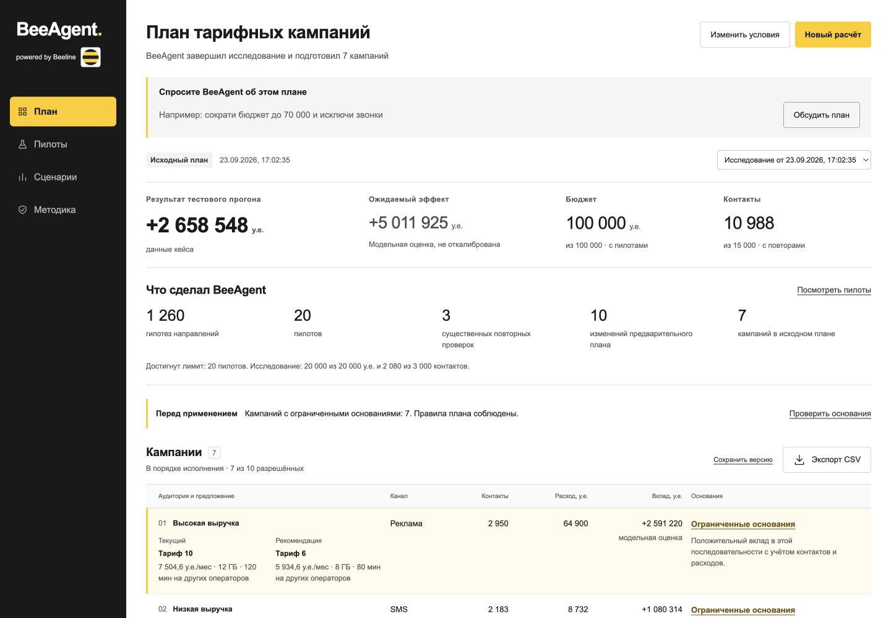
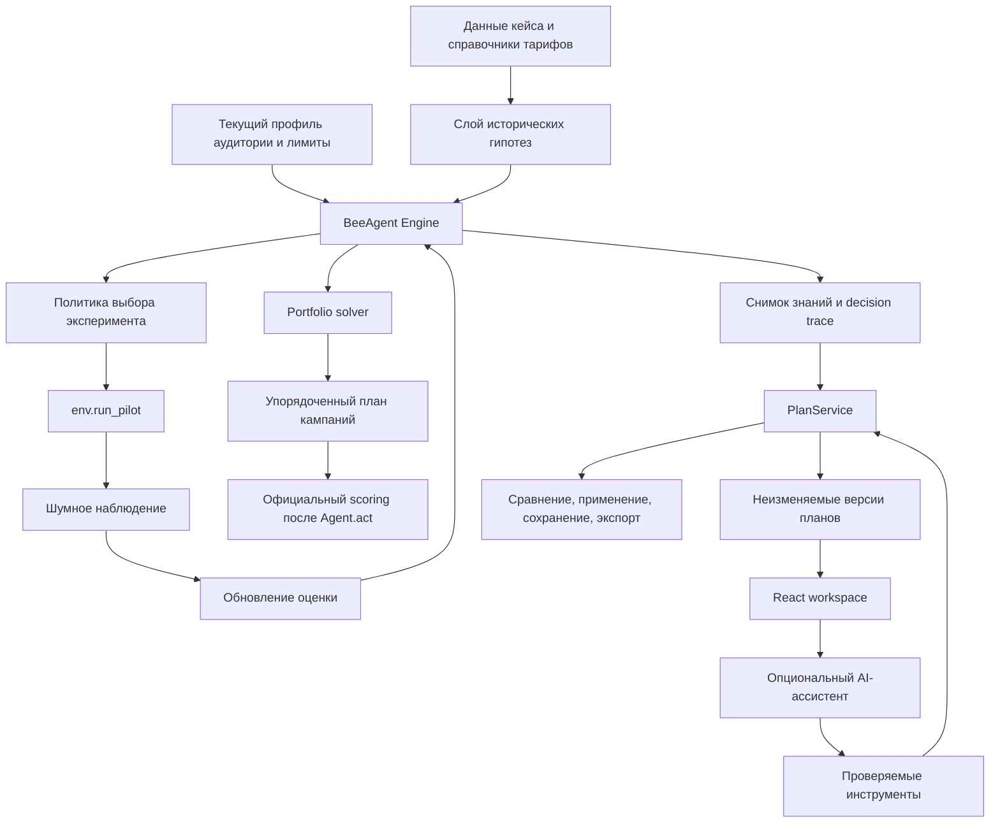

# BeeAgent

**powered by Beeline**

> Agentic AI-система для управления тарифными маркетинговыми кампаниями. BeeAgent сам решает, какие гипотезы стоит проверить, учится на пилотах, обновляет оценки и собирает исполнимый портфель кампаний в пределах бюджета и охвата.



## Что решает BeeAgent

Планирование тарифных кампаний происходит в условиях неполной информации.

Исторические переходы относятся к другой аудитории. Даже привлекательный переход в истории не гарантирует такой же эффект на текущей клиентской базе. Маленький пилот слишком шумный, а большой пилот расходует тот же бюджет и охват, которые затем нужны основным кампаниям.

BeeAgent превращает эту неопределённость в управляемый цикл принятия решений:

1. формирует гипотезы на основе исторических переходов и параметров тарифов;
2. оценивает неопределённость и не принимает историю за истину;
3. выбирает следующий пилот там, где новое наблюдение может изменить итоговый план;
4. обновляет оценку после каждого результата;
5. повторно проверяет крупные решения, если одного наблюдения недостаточно;
6. собирает упорядоченный портфель кампаний с учётом бюджета, контактов и ограничений;
7. показывает основания каждого решения;
8. позволяет маркетологу менять бизнес-условия и сравнивать версии до применения.

BeeAgent выдаёт не просто рейтинг кампаний, а воспроизводимый процесс принятия решения с наблюдениями, версиями и журналом изменений.

Все данные кейса синтетические. Результаты проекта не отражают реальные показатели Beeline.

## Что получает маркетолог

Рабочее пространство состоит из четырёх разделов:

- **План** - итоговый портфель кампаний, результат проверки, прогноз, ресурсы и основания решений.
- **Пилоты** - что BeeAgent проверял, что получил и как наблюдение изменило предварительный план.
- **Сценарии** - альтернативные бюджеты, каналы и ограничения со сравнением версий и явным применением.
- **Методика** - данные, допущения, ограничения модели и воспроизводимость.

С BeeAgent можно работать и обычным языком. Например:

- `Сократи бюджет на 30%, исключи звонки и оставь максимум пять кампаний`
- `Почему в этой кампании выбран SMS, а не звонок?`
- `Какие решения опираются на самые слабые основания?`

LLM не считает экономику кампаний самостоятельно. Она вызывает проверяемые серверные инструменты, а расчёт выполняет тот же детерминированный `Engine`, который используется рабочим интерфейсом.

## Быстрый запуск

### Требования

Требования к локальному запуску:

- Python 3.11+
- Node.js 20.19+
- npm
- macOS или Linux shell для `run.sh`

Чистая установка проверена на macOS arm64 с Python 3.12 и Node.js 20. Linux отдельно не проверялся.

Сам конкурсный агент не требует Node.js, web-сервера или OpenAI API.

### Развёртывание с чистого клона

```sh
git clone https://github.com/BAITC-Hacks/hack-6b518c43-dogs.git
cd hack-6b518c43-dogs

python3 -m venv .venv
source .venv/bin/activate

python -m pip install -r requirements.txt -r requirements-server.txt
npm --prefix frontend ci

./run.sh
```

Открыть:

```text
http://127.0.0.1:8765
```

`run.sh` при необходимости собирает frontend и запускает локальный backend. Внешняя база данных или облачное развёртывание для проверки не нужны.

Другой порт:

```sh
./run.sh --port 8766
```

## Проверка за 3 минуты

После запуска приложения:

1. Откройте **План** и нажмите `Новый расчёт`.
2. Запустите расчёт. BeeAgent проведёт пилоты через публичный интерфейс среды и соберёт итоговый портфель.
3. Откройте блок `Что сделал BeeAgent`. В нём показаны гипотезы, пилоты, повторные проверки, изменения решений и причина остановки исследования.
4. Откройте любую кампанию и изучите `Основания решения`.
5. Перейдите в **Пилоты** и откройте наблюдение, которое изменило предварительный план.
6. Перейдите в **Сценарии**. Задайте бюджет `70 000`, отключите звонки и установите максимум `5` кампаний.
7. Подготовьте вариант и сравните его с активным планом.
8. Примените вариант вручную. BeeAgent никогда не применяет предложенный сценарий автоматически.
9. Сохраните план, обновите страницу и экспортируйте CSV.
10. При необходимости вернитесь к исходной измеренной версии.

Изменённый сценарий использует уже полученные наблюдения и не запускает новые пилоты.

## Архитектура



### Важная граница

Результат официального scoring не передаётся обратно в выбор кампаний.

`Agent.act(env)` использует только публичную среду, исторические файлы и наблюдения, полученные через `env.run_pilot`. Рабочий интерфейс и AI-ассистент используют тот же `Engine` через сохранённый снимок знаний. Отдельного демонстрационного рекомендателя нет.

## Как работает агент

### 1. Исторические гипотезы

`History` в `agent.py` превращает исторические переходы между тарифами в слабые priors.

История рассматривается как ассоциация, а не доказанный causal uplift. Разреженные направления объединяются с более широкими статистиками и параметрами тарифов. Неопределённость сохраняется, потому что текущая аудитория отличается от исторической.

### 2. Адаптивная разведка

`Engine.next_pilot()` выбирает следующий эксперимент с учётом:

- возможного влияния на итоговое решение;
- текущей неопределённости;
- доступного охвата;
- стоимости канала;
- оставшегося бюджета и контактов;
- необходимости повторно подтвердить крупное решение.

Размер пилота не задан одной константой для всех случаев. Агент может выбирать разные размеры выборки и возвращаться к важным неопределённым направлениям.

### 3. Обновление знания

`Engine.observe()` обновляет оценку с учётом фактического числа контактов и полученного шумного эффекта.

Если первое наблюдение резко противоречит истории, система может увеличить неопределённость prior вместо безусловного доверия историческим данным.

### 4. Сборка портфеля

`Engine.solve()` строит упорядоченный портфель кампаний.

В расчёте учитываются:

- общий бюджет;
- общий лимит контактов;
- максимум контактов на кампанию;
- порядок кампаний;
- стоимость канала;
- пересечение аудиторий;
- повторные контакты;
- правило, что один клиент даёт эффект только от лучшей кампании.

Оптимизатор эвристический и не заявляет глобальный оптимум.

### 5. Основания и версии

Каждый запуск сохраняет:

- журнал пилотов;
- оценки до и после наблюдений;
- предварительные решения;
- финальный план;
- снимок знаний;
- идентичность версии;
- измеренный результат только для точно проверенной версии.

Альтернативные планы сохраняются как отдельные неизменяемые версии. Результат одной версии не переносится на другую.

## Основные компоненты

| Компонент | Ответственность |
|---|---|
| `agent.py` | `Agent`, priors, неопределённость, адаптивные пилоты, forecast ledger и portfolio solver |
| `environment.py` | Публичная среда организаторов |
| `scoring_core.py` | Механика официального scoring, используется без изменений |
| `backend/server.py` | Локальный HTTP API, выполнение запусков, frontend и локальное хранилище |
| `backend/plans.py` | Версии планов, пересчёт сценариев, сравнение, применение и CSV export |
| `backend/presentation.py` | Понятные человеку summaries активности и оснований |
| `backend/assistant.py` | Опциональная OpenAI orchestration с валидируемыми tools |
| `frontend/` | Рабочее место маркетингового аналитика |
| `tools/verify_submission.py` | Единая воспроизводимая проверка сдачи |
| `reports/stage4/` | Текущие артефакты тестирования и сохранённые результаты |

## Технологии

| Слой | Технологии |
|---|---|
| Decision engine | Python 3.11+, NumPy 2.3.5, pandas 2.2.3 |
| Local backend | Python `ThreadingHTTPServer`, JSON/CSV storage |
| Версии планов | Immutable JSON files |
| AI usage ledger | SQLite через стандартную библиотеку Python |
| Frontend | React 19.1.1, TypeScript 5.9.2, Vite 7.1.7 |
| AI assistant | OpenAI Python SDK 2.54.0, Responses API, function calling, structured outputs |
| Проверка структуры | `jsonschema` 4.26.0 |
| Local config | python-dotenv 1.2.3 |
| Verification | `local_eval.py`, `make_submission.py`, unit tests, browser checks |

Для локальной проверки не нужны внешняя БД, Docker, облачный backend или сторонняя авторизация.

## OpenAI assistant

Конкурсный scoring не зависит от OpenAI.

Опциональный ассистент умеет:

- дать сводку активного плана;
- объяснить основания выбранной кампании;
- подготовить сценарий с новыми ограничениями;
- сравнить две версии плана.

Ассистент не может:

- самостоятельно применить план;
- запускать новые пилоты при what-if пересчёте;
- менять официальный `submission.csv`;
- придумывать числовые показатели вне валидированных ссылок backend.

### Подключение

Без терминала: нажмите `Обсудить план`, затем `Подключить OpenAI` (или `Настройка подключения`, если ключ уже задан). Вставьте собственный ключ в скрытое поле и нажмите `Сохранить ключ локально`. Поле сразу очищается, перезапуск не требуется. Сохранение ключа не выполняет платного запроса.

Вариант через терминал:

```sh
source .venv/bin/activate
python tools/configure_ai.py
./run.sh
```

Ключ вводится скрыто и сохраняется только в локальном `.env` с правами `0600`, который игнорируется Git. CLI не перезаписывает существующий файл; интерфейс позволяет заменить ключ, сохраняя лимиты и журнал расходов. В репозитории находится только шаблон [`.env.example`](.env.example) без ключа.

Модель по умолчанию:

```text
gpt-5.4-mini
```

Проверяющий может использовать собственный `OPENAI_API_KEY`. Все не-AI функции продолжают работать без ключа.

### Переменные окружения

| Variable | Обязательна | Default | Назначение |
|---|---|---:|---|
| `OPENAI_API_KEY` | Нет | пусто | Включает серверный AI assistant |
| `OPENAI_MODEL` | Нет | `gpt-5.4-mini` | Модель ассистента |
| `BEEAGENT_AI_BUDGET_USD` | Нет | `3` | Локальный guardrail оценки расходов |
| `BEEAGENT_AI_MAX_CALLS` | Нет | `100` | Максимум учтённых model calls |
| `BEEAGENT_STORAGE_DIR` | Нет | `reports/runs` | Альтернативное локальное хранилище |
| `BEEAGENT_INPUT_USD_PER_MILLION` | Для неизвестной модели | model default | Локальная оценка input cost |
| `BEEAGENT_CACHED_USD_PER_MILLION` | Для неизвестной модели | model default | Локальная оценка cached input |
| `BEEAGENT_OUTPUT_USD_PER_MILLION` | Для неизвестной модели | model default | Локальная оценка output cost |
| `BEEAGENT_CACHE_WRITE_USD_PER_MILLION` | Для неизвестной модели | model default | Локальная оценка cache write |

Локальный spend ledger является оценкой и не ограничивает фактический billing аккаунта.

## Статус реальной AI-интеграции

GPT-5.4 mini была проверена через настоящий OpenAI API.

В первых шести внешних сценариях:

- четыре прошли полностью;
- один ответ модели был отклонён валидатором;
- в одном вопросе про весь план модель выбрала инструмент отдельной кампании вместо plan summary.

Ошибки сохранены в отчёте. Логика после этого была уточнена и проверена локально, но эти два исправленных сценария ещё не были повторно прогнаны через внешний API.

Первый внешний тест использовал 12 model calls с учётом tool continuations, около 47 630 input tokens и 2 568 output tokens. Локальная оценка расходов составила около `$0.047`.

Все исходы: [отчёт реальной AI-интеграции](reports/stage4/ai_integration.json).

При работающем приложении с уже рассчитанным планом:

```sh
# Только локальная проверка конфигурации, без обращения в OpenAI:
python tools/check_ai_connection.py
# Явный запуск шести платных сценариев с собственным ключом:
python tools/check_ai_connection.py --paid-smoke
```

Предложения не применяются автоматически. Успешный ответ настоящего API в браузере отдельно ещё не воспроизводился; HTTP-проверка и локальные протокольные тесты описаны в [отчёте тестирования](docs/TESTING_STAGE4.md).

## Покрытие требований кейса

| Требование | Реализация BeeAgent | Проверка |
|---|---|---|
| `Agent.act(env)` работает | Самодостаточный конкурсный агент в `agent.py` | `python tools/verify_submission.py` |
| От 1 до 10 валидных кампаний | Solver выдаёт допустимые тарифы, каналы и фильтры | Submission verification и официальный прогон |
| Пилоты влияют на решение | Адаптивный цикл `next_pilot` / `observe` меняет оценки и планы | Официальный прогон, раздел `Пилоты`, unit tests |
| Соблюдение лимитов | Бюджет, контакты, пилоты и campaign caps учитываются в движке | Официальный scoring и resource checks |
| Воспроизводимый `submission.csv` | Генерируется неизменённым скриптом организаторов в свежих процессах | `python tools/verify_submission.py` |
| Учёт неопределённости | Mean, variance, размер пилота и interval | `Основания решения`, tests |
| Адаптивная разведка | Следующий эксперимент зависит от наблюдений | Decision trace |
| Осмысленный канал | Стоимость и behavior канала участвуют в плане | Solver и channel comparison |
| Устойчивость | Сохранены официальные seeds 0-9 | `local_eval.py --runs 10` |
| LLM в контуре решения | Grounded server tools вызывают настоящий planning engine | AI integration artifact |

## Воспроизводимость

Основная команда проверки:

```sh
source .venv/bin/activate
python tools/verify_submission.py
```

Она проверяет:

- неизменность защищённых файлов организаторов;
- импорт `Agent`;
- официальный локальный прогон;
- бюджет, контакты и лимит пилотов;
- десять официальных seed-прогонов;
- повторную генерацию `submission.csv` в свежих процессах;
- одинаковый результат при разных `PYTHONHASHSEED`;
- отсутствие зависимости конкурсного пути от OpenAI;
- валидность количества кампаний, тарифов и каналов;
- заблокированную сеть во время конкурсной проверки.

Дополнительные проверки:

```sh
python -m unittest discover -s tests -v
npm --prefix frontend run build
node tools/check_ui_copy.mjs
node tools/test_presentation.mjs
python tools/check_clean_install.py
```

Уже выполнены 31 unit/protocol-тест, сборка, чистая установка и браузерные проверки на ширинах 1440, 1280 и 390 px. Проверены ручной сценарий без API, сравнение, явное применение, сохранение после перезагрузки и экспорт. [Фактические результаты и границы проверки](docs/TESTING_STAGE4.md).

## Фактические результаты на данных кейса

Эти значения относятся только к синтетической открытой среде кейса. Они не являются реальными показателями Beeline и не прогнозируют скрытое судейство.

| Проверка | Результат |
|---|---:|
| Seed 42, net result | 2 658 548 у.е. |
| Forecast того же плана | 5 011 925 у.е. |
| Завышение forecast | 2 353 376 у.е. |
| Communication spend | 100 000 у.е. |
| Contacts | 10 988 |
| Pilots | 20 |
| Final campaigns | 7 |
| Seeds 0-9, median | 2 879 746 у.е. |
| Seeds 0-9, minimum | 2 399 590 у.е. |
| Seeds 0-9, positive | 10 / 10 |

Forecast остаётся существенно оптимистичным. BeeAgent показывает это ограничение явно и не выдаёт прогноз за гарантированный результат.

На этапе 4 численная политика `beeagent-repeat-3` и submission сохранены побайтно. Выбор политики на этапе 3 проводился по заранее зафиксированному протоколу: сохранены 68 разработочных и 120 отложенных исходов. На отложенных официальных seed выбранная политика улучшила результат предыдущей версии, но уступила варианту с фиксированными пилотами. Во всех четырёх авторских стресс-мирах её медиана ухудшилась; при смене лучшего направления пять из пяти исходов отрицательны. Универсальная устойчивость не доказана. [Полное сравнение](docs/NUMERICAL_STAGE3.md).

## Приватность и безопасность

- Исходные данные и scoring files организаторов не изменены.
- Полные строки клиентов и их ID не передаются в OpenAI.
- Ассистент получает агрегаты плана, выбранные основания и параметры тарифов.
- API key хранится только на backend.
- Ключ не коммитится, не возвращается API и не сохраняется в browser localStorage.
- AI не может применить план самостоятельно.
- Основная конкурсная проверка не требует внешнего API или личного аккаунта участника.

## Известные ограничения

- Исторические переходы не доказывают причинность.
- Forecast не откалиброван и остаётся оптимистичным в открытой среде кейса.
- Portfolio optimization эвристический и не гарантирует глобальный optimum.
- ID клиентов из пилотной выборки недоступны агенту, поэтому часть overlap оценивается вероятностно.
- Позднему крупному решению может не хватить ресурса на повторный пилот.
- Эффекты скрытого судейства неизвестны.
- Нет реальной отправки кампаний, публичного хостинга, авторизации и production multi-user security.
- Safari, Firefox, физический телефон и полный screen-reader/WCAG audit не проверялись исчерпывающе.
- Два исправленных AI edge cases пока повторно проверены только локально.

## Артефакты сдачи

Обязательные артефакты кейса:

- `agent.py`
- `submission.csv`
- `requirements.txt`

Репозиторий дополнительно содержит рабочий интерфейс, архитектуру, инструменты воспроизводимости и сохранённые доказательства проверок.

SHA-256 текущего `submission.csv`:

```text
f3935486bd54ebe001b9aa54c1773d51fff91387b585c57c9f9542658502197f
```

## Документация

- [`docs/TESTING_STAGE4.md`](docs/TESTING_STAGE4.md) - актуальный отчёт тестирования
- [`docs/PRODUCT_STAGE4.md`](docs/PRODUCT_STAGE4.md) - продуктовые и UX решения
- [`docs/ACCEPTANCE.md`](docs/ACCEPTANCE.md) - карта приёмки
- [`docs/DEMO.md`](docs/DEMO.md) - сценарий демонстрации
- [`docs/AI_ASSISTANT.md`](docs/AI_ASSISTANT.md) - архитектура и ограничения ассистента
- [`docs/NUMERICAL_STAGE3.md`](docs/NUMERICAL_STAGE3.md) - эксперимент численной политики и сохранённые результаты

---

**BeeAgent превращает неопределённые тарифные возможности в объяснимый план кампаний, который маркетолог может проверить, оспорить и применить.**
