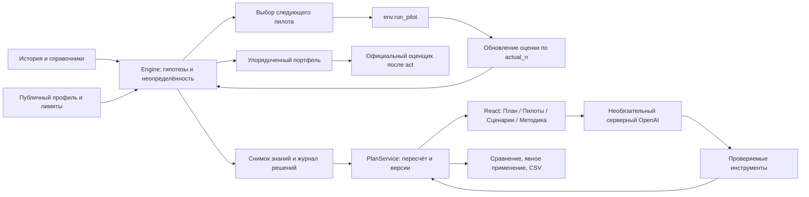

# BeeAgent
**powered by Beeline**

BeeAgent помогает маркетологу выбрать последовательность тарифных кампаний: проверяет исторические гипотезы пилотами, обновляет оценки и составляет план в пределах бюджета и контактов.

Проблема: удачный переход в истории другой аудитории ещё не доказывает эффект новой кампании. BeeAgent расходует ограниченный ресурс исследования там, где наблюдение может изменить решение, сохраняет основания и позволяет сравнить условия до применения плана. Все данные в проекте синтетические, результаты не отражают бизнес Beeline.

## Запуск

```sh
./run.sh
```

Открыть [рабочее место](http://127.0.0.1:8765). Сервер доступен только на локальном компьютере. Первая установка требует Python 3.11+ и Node 20.19+:

```sh
python3 -m venv .venv
source .venv/bin/activate
python -m pip install -r requirements.txt -r requirements-server.txt
npm --prefix frontend ci
./run.sh
```

`run.sh` собирает отсутствующий или изменённый интерфейс. После установки ручные функции и конкурсный агент работают без интернета и API-ключа. Для `local_eval.py` нужны только исходный комплект, `agent.py` и организаторский `requirements.txt`; Node и серверные зависимости не нужны.

## Проверка за три минуты

1. **План:** нажмите «Новый расчёт», затем «Начать расчёт». После реальных пилотов появятся результат тестового прогона, отдельный прогноз, расходы и кампании.
2. **Основания:** откройте основания кампании. Посмотрите число наблюдений, прямую историю и интервал модели. В разделе «Пилоты» раскройте реальные планы до и после наблюдения.
3. **Сценарии:** задайте бюджет 70 000, отключите звонки, максимум 5 кампаний. Нажмите «Подготовить вариант». Новых пилотов нет, активный план ещё не изменён.
4. **Сравнение:** проверьте расходы и добавленные/убранные/изменённые кампании. Явно примените вариант. Результат исходного тестового прогона не переносится на новую версию.
5. **Сохранение:** сохраните версию, обновите страницу, экспортируйте CSV. Предыдущие версии доступны в «Сценариях». Экспорт интерфейса не перезаписывает конкурсный `submission.csv`.

Командная проверка сдачи: `python tools/verify_submission.py`. Подробности: [текущий отчёт проверок](docs/TESTING_STAGE4.md), [карта требований](docs/ACCEPTANCE.md), [сценарий показа](docs/DEMO.md).

## Архитектура



Оценщик не передаёт результаты обратно в выбор кампаний. Интерфейс и инструменты AI вызывают тот же `Engine`, используя сохранённый снимок; параллельного демонстрационного расчёта нет.

## Почему система агентная

`Agent.act(env)` читает только публичные входы. История задаёт слабые гипотезы, а не причинный эффект или измеренную конверсию. `Engine.next_pilot` выбирает полезное наблюдение с учётом неопределённости, размера будущего решения и расхода ресурсов. Агент действует через `env.run_pilot`, получает реальное число контактов и шумное наблюдение, затем `Engine.observe` обновляет среднее и дисперсию.

Следующий пилот зависит от полученных результатов. Начиная с пятого шага политика может повторно проверять крупные решения после одного наблюдения. Реальные предварительные планы до/после сохраняются. После остановки `Engine.solve` возвращает последовательный портфель с учётом бюджета, контактов, пересечений и порядка. `Agent` не читает скрытые эффекты и не использует эталонные результаты как вход.

Политика этапа 3 **не изменялась** на этапе 4: `beeagent-repeat-3`. [Исходное состояние этапа 4](reports/stage4/baseline.json) фиксирует коммит и хеши агента/submission. Новые уровни оснований служат пояснением интерфейса, не меняют численный отбор.

## Проверка требований кейса

| Requirement | Implementation | How to verify | Evidence |
|---|---|---|---|
| Обязательно: `Agent.act(env)` без ошибок | Самодостаточный `agent.py`, публичный интерфейс среды | `python tools/verify_submission.py` | [Официальный прогон](reports/stage4/local_eval.log) |
| Обязательно: 1–10 корректных кампаний | Допустимые фильтры, тарифы, четыре канала, последовательность | Та же команда, проверка CSV | [7 кампаний, валидные тарифы/каналы](reports/stage4/verification.json) |
| Обязательно: реальные пилоты влияют на решения | `next_pilot`, `observe`, предварительные планы | Раздел «Пилоты»; unit-тест изменённых наблюдений | [Тесты](reports/stage4/unit_tests.log), [журнал влияния](reports/stage3/decision_trace.json) |
| Обязательно: лимиты бюджета, контактов и пилотов | Учёт пилотного расхода, усечения и повторных контактов | Официальный прогон; тесты ресурсов и порядка | [Прогон](reports/stage4/local_eval.log), [тесты](reports/stage4/unit_tests.log) |
| Обязательно: воспроизводимый `submission.csv` | Неизменённый организаторский генератор, свежие процессы | `python tools/verify_submission.py` | [Хеш и проверка байтов](reports/stage4/verification.json) |
| Опционально: неопределённость | Среднее/дисперсия, вес фактического размера пилота, интервалы | «Основания решения», тест повторных наблюдений | [Тесты](reports/stage4/unit_tests.log) |
| Опционально: адаптивная разведка | Выбор следующей гипотезы и размера; повторные материальные решения | «Пилоты», `Engine.next_pilot` | [Численная политика](docs/NUMERICAL_STAGE3.md) |
| Опционально: выбор канала | Стоимость контакта, переносимая оценка для SMS/Push/рекламы, отдельная для звонка | Кампании; условная замена канала через AI-инструмент | [Тесты каналов](reports/stage4/unit_tests.log) |
| Опционально: устойчивость на десяти seed | Официальные seeds 0–9, все исходы сохранены | Та же команда проверки сдачи | [10/10 положительных](reports/stage4/local_eval_10.log) |
| Опционально: LLM в принятии решений | Серверные инструменты вызывают пересчёт, предложение требует применения | Новый локальный ключ и `--paid-smoke` | [6 реальных сценариев: 4 прошли, 2 выявили ошибки](reports/stage4/ai_integration.json); пересчёт и объяснения вызвали инструменты |
| Дополнительно: условия, версии, исправление, экспорт | Тот же движок и снимок, без новых пилотов | Трёхминутный сценарий выше | [HTTP-проверки](reports/stage4/http_checks.json), [браузер](docs/TESTING_STAGE4.md) |
| Дополнительно: неизменность исходников организаторов | SHA-256 16 защищённых файлов | `python tools/verify_originals.py` | [Проверка](reports/stage4/originals_after.log) |

## Проверки и воспроизводимость

```sh
source .venv/bin/activate
python tools/verify_submission.py
python -m unittest discover -s tests -v
npm --prefix frontend run build
node tools/check_ui_copy.mjs
node tools/test_presentation.mjs
# При работающем сервере без API-ключа:
python tools/smoke_stage3.py
# Отдельная установка из PyPI/npm с пустыми кешами и без ключей:
python tools/check_clean_install.py
```

Единая команда сдачи запускает **неизменённые** `local_eval.py`, `local_eval.py --runs 10` и `make_submission.py`, проверяет исходные файлы, импорт, CSV и одинаковые байты двух свежих процессов. Сетевые подключения в этих процессах запрещены; один процесс получает заведомо фиктивный ключ, другой работает без ключа. Сводка и исходный вывод записываются в `reports/stage4/`.

`submission.csv`: **7 строк**, SHA-256:
`f3935486bd54ebe001b9aa54c1773d51fff91387b585c57c9f9542658502197f`.

## Фактические результаты и ограничения прогноза

| Проверка | Результат |
|---|---:|
| Официальный прогон 42, net | 2 658 548 у.е. |
| Прогноз того же плана | 5 011 925 у.е. |
| Завышение прогноза | 2 353 376 у.е. |
| Расход / контакты | 100 000 у.е. / 10 988 |
| Пилоты / финальные кампании | 20 / 7 |
| Официальные seeds 0–9, медиана | 2 879 746 у.е. |
| Минимум / максимум | 2 399 590 / 3 373 302 у.е. |
| Положительные прогоны | 10 из 10 |

Здесь округлённые результаты открытой проверки, не доход Beeline и не прогноз скрытого судейства. Модельная оценка существенно завышена; интерфейс показывает это явно. Вариантам без собственного измерения не приписывается результат исходного плана.

Выбор политики на этапе 3 выполнен по заранее сохранённому протоколу: **68 разработочных и 120 отложенных исходов**. На отложенных seeds 100–109 медиана выросла относительно предыдущей версии с 2 166 868 до 2 835 492, средняя абсолютная ошибка снизилась с 5 514 714 до 2 382 805. Фиксированные пилоты там дали более высокую медиану 4 532 277. Во всех четырёх авторских мирах медиана выбранной политики ухудшилась; при смене лучшего направления все пять исходов отрицательны. Универсальная устойчивость не доказана, второй кандидат отклонён. [Полное сравнение и все исходы](docs/NUMERICAL_STAGE3.md).

## AI для пользователя и проверяющего

**GPT-5.4 mini проверена через настоящий OpenAI API с новым локальным ключом.** В первых шести сценариях четыре полностью прошли: реальный пересчёт, объяснения канала и обзор слабых оснований. Один ответ был отклонён валидатором, ещё один выбрал паспорт одной кампании вместо обзора плана. Исходы сохранены, без удаления ошибок. 12 обращений к модели с учётом инструментов, 47 630 входных и 2 568 выходных токенов, оценка расходов $0,0472785. [Все исходы](reports/stage4/ai_integration.json).

Добавлены более точные описания инструментов и одна ограниченная попытка исправления ссылок. Локальный протокольный тест проходит; повторная внешняя проверка двух исправленных сценариев требует отдельного разрешения на дополнительные запросы. Это ограниченная проверка, не гарантия общей надёжности.

Проще без терминала: «Обсудить план», «Подключить OpenAI», скрытое поле ключа, «Сохранить ключ локально». GPT-5.4 mini включается без перезапуска. Сохранение не делает платного запроса.

Проверяющий использует собственный новый ключ. Вариант через терминал:

```sh
source .venv/bin/activate
python tools/configure_ai.py
./run.sh
# В другом терминале после расчёта плана:
python tools/check_ai_connection.py --output reports/stage4/ai_integration.json
# Платная проверка, только по явному вызову:
python tools/check_ai_connection.py --paid-smoke --output reports/stage4/ai_integration.json
```

Ключ вводится скрыто. CLI создаёт игнорируемый `.env` с правами 0600 и не перезаписывает существующий; UI позволяет заменить ключ, сохраняя лимиты и учёт расходов. Можно задать `OPENAI_API_KEY` через окружение. После CLI-настройки сервер нужно перезапустить; после настройки через UI не нужно. По запросу пользователя модель по умолчанию [`gpt-5.4-mini`](https://developers.openai.com/api/docs/models/gpt-5.4-mini), локальный предел **оценки** расходов $3 и 100 вызовов; учёт расходов сохраняется между перезапусками и не является лимитом биллинга аккаунта.

Четыре инструмента: сводка плана, основания кампании, реальный пересчёт сценария, сравнение версий. Ассистент не применяет предложение, не запускает пилоты и не вызывается при загрузке страницы или работе оценщика. Метрики и пояснения сервер возвращает по проверенным ссылкам. Запросы для проверки:

- «Сократи бюджет на 30%, исключи звонки и оставь максимум пять кампаний».
- «Почему в этой кампании выбран SMS, а не звонок?» Выберите кампанию с SMS.
- «Какие решения опираются на самые слабые основания?»

[Настройка, инструменты, ограничения и обработка ошибок](docs/AI_ASSISTANT.md).

## Данные и приватность

Исходные данные, среда и оценщик не изменены. Сервер хранит исследования и версии в локальном `reports/runs/`, расходы AI в SQLite; эти файлы не коммитятся. `BEEAGENT_STORAGE_DIR` задаёт другое хранилище. Измерение связано с точным планом, движком, данными и снимком. Несовместимые архивы остаются доступны для просмотра/экспорта.

В OpenAI передаются только агрегаты плана, параметры тарифов и выбранные наблюдения. Клиентские строки и идентификаторы не передаются. Ключ из переписки не используется. Скрытое поле локальной страницы очищается при отправке на локальный сервер; ключ не сохраняется в localStorage, JS bundle, исходниках и отчётах. Официальный логотип хранится локально: [проверенный источник](docs/BRAND_SOURCES.md).

## Известные ограничения

- Прогноз не откалиброван. Исторические переходы не являются причинным эффектом.
- Оптимизатор эвристический; глобальный оптимум не гарантирован. Пилотные пересечения оцениваются вероятностно, поскольку ID пилотных клиентов недоступны.
- Жёсткого подбюджета только для повторных подтверждений нет. Позднему крупному решению может не хватить пилотных ресурсов.
- Уровень оснований относится ко всем модельным группам аудитории до усечения. Это правило пояснения, не вероятность успеха.
- Скрытое судейство, реальные рассылки, публичный хостинг и многопользовательская безопасность не проверялись и не добавлялись.
- Внешний AI проверен на шести сценариях с двумя сбоями. Исправления пока проверены локально; устойчивость произвольных запросов не доказана.

Исторические отчёты сохранены для аудита. Папка `reports/levra/` содержит старые артефакты и рабочий файл снимка движка; название не является текущим брендом. Архивные `forecast_audit.py` и `forecast_diagnosis.py` не предназначены для действующей политики.
